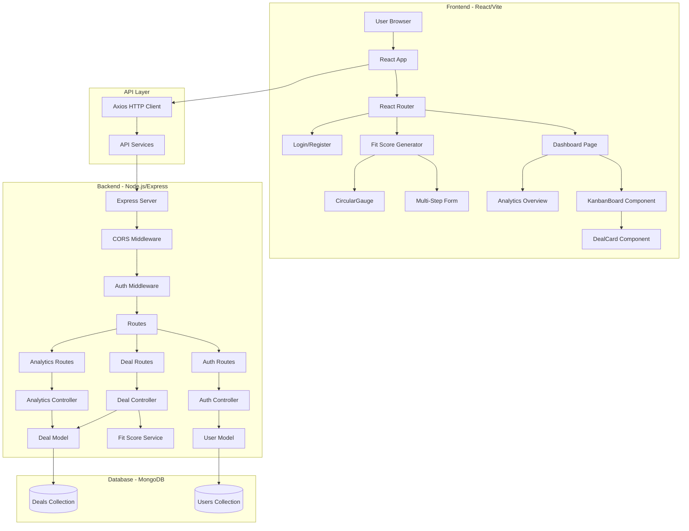

# Architecture Documentation
## Smart M&A Fit & Pipeline Management Platform

> **Last Updated**: 2026-02-12  
> **Purpose**: This document explains the system architecture, design decisions, and how components interact.

---

## Table of Contents
1. [System Overview](#system-overview)
2. [Architecture Diagram](#architecture-diagram)
3. [Technology Stack](#technology-stack)
4. [Component Details](#component-details)
5. [Data Flow](#data-flow)
6. [Database Schema](#database-schema)
7. [API Design](#api-design)
8. [Security Architecture](#security-architecture)
9. [Deployment Architecture](#deployment-architecture)

---

## System Overview

### High-Level Architecture
The M&A Platform follows a **3-tier client-server architecture**:

```
┌─────────────────────────────────────────────────────────────┐
│                    PRESENTATION LAYER                       │
│                   (React Frontend - Port 5173)              │
│  • Kanban Dashboard                                         │
│  • Fit Score Generator                                      │
│  • User Authentication UI                                   │
└─────────────────────────────────────────────────────────────┘
                            ↕ HTTP/REST API
┌─────────────────────────────────────────────────────────────┐
│                    APPLICATION LAYER                        │
│                (Node.js/Express - Port 5000)                │
│  • Authentication Middleware                                │
│  • Business Logic (Fit Score Calculation)                   │
│  • API Routes & Controllers                                 │
└─────────────────────────────────────────────────────────────┘
                            ↕ Mongoose ODM
┌─────────────────────────────────────────────────────────────┐
│                      DATA LAYER                             │
│                  (MongoDB - Port 27017)                     │
│  • Users Collection                                         │
│  • Deals Collection                                         │
│  • Notes/Attachments                                        │
└─────────────────────────────────────────────────────────────┘
```

---

## Architecture Diagram



---

## Technology Stack

### Frontend Stack
| Technology | Version | Purpose |
|------------|---------|---------|
| React | 18.x | UI framework |
| Vite | 5.x | Build tool and dev server |
| Tailwind CSS | 3.x | Utility-first styling |
| React Router | 6.x | Client-side routing |
| @hello-pangea/dnd | 16.x | Drag-and-drop functionality |
| Recharts | 2.x | Data visualization |
| React Hook Form | 7.x | Form state management |
| Axios | 1.x | HTTP client |
| React Toastify | 9.x | Toast notifications |
| @tanstack/react-query | 5.x | Data fetching and caching |
| zustand | 4.x | Lightweight state management |
| zod | 3.x | Schema validation |
| jspdf | 4.x | PDF report generation |
| jspdf-autotable | 5.x | PDF table formatting |
| xlsx | 0.18.x | Excel export functionality |
| lucide-react | 0.309.x | Modern icon library |
| date-fns | 3.x | Date formatting and manipulation |
| @hookform/resolvers | 3.x | Form validation resolvers |


### Backend Stack
| Technology | Version | Purpose |
|------------|---------|---------|
| Node.js | 18+ | Runtime environment |
| Express.js | 4.x | Web framework |
| MongoDB | 6+ | NoSQL database |
| Mongoose | 8.x | MongoDB ODM |
| jsonwebtoken | 9.x | JWT authentication |
| bcryptjs | 2.x | Password hashing |
| cors | 2.x | Cross-origin resource sharing |
| dotenv | 16.x | Environment configuration |

---

## Component Details

### Frontend Components

#### 1. Dashboard Components (`frontend/src/components/dashboard/`)
- **KanbanBoard.jsx**: Main pipeline visualization
  - Manages 4 stage columns
  - Handles drag-and-drop events
  - Syncs state with backend
- **DealCard.jsx**: Individual deal representation
  - Displays fit score, company name, metrics
  - Provides quick actions (edit, delete, view)

#### 2. Fit Score Components (`frontend/src/components/fitScore/`)
- **FitScoreForm.jsx**: Multi-step form wizard
  - 6 steps for comprehensive data collection
  - Form validation with React Hook Form
  - Progress indicator

#### 3. Visualization Components (`frontend/src/components/visualizations/`)
- **CircularGauge.jsx**: SVG-based fit score gauge
  - Color-coded by score range (0-20 red, 81-100 green)
  - Animated transitions
  - Large numeric score display
- **InsightsCard.jsx**: Strengths/risks/recommendations display
  - Color-coded sections (green for strengths, red for risks)
  - Icon-based visual identification
  - Prioritized actionable recommendations
- **MetricBarChart.jsx**: Metric comparison visualization
  - Shows raw and weighted metric scores
  - Interactive tooltips with exact values
  - Color-coded by metric importance
- **WeightDistributionChart.jsx**: Donut chart for weight breakdown
  - Displays percentage contribution per metric
  - Interactive segments with detailed breakdown
  - Legend with exact percentages

#### 4. Comparison Components (`frontend/src/components/comparison/`)
- **ComparisonRadarChart.jsx**: Multi-deal radar comparison
  - Visual comparison across all four metrics
  - Multiple colored overlays for different deals
  - Helpful for competitive analysis
- **ComparisonTable.jsx**: Side-by-side deal comparison
  - Detailed metric comparison
  - Export functionality
  - Multi-deal selection support

#### 5. Collaboration Components (`frontend/src/components/collaboration/`)
- **NotesSection.jsx**: Team notes and comments
  - Comment threading on deals
  - User mentions functionality
  - Activity tracking and timestamps

#### 6. Common Components (`frontend/src/components/common/`)
- **Header.jsx**: Navigation bar
- **Sidebar.jsx**: Side navigation
- **LoadingSpinner.jsx**: Loading states
- **Modal.jsx**: Reusable modal dialogs

#### 7. Page Components (`frontend/src/pages/`)
- **Dashboard.jsx**: Main Kanban pipeline view
- **FitScoreGenerator.jsx**: Multi-step form for creating deals
- **DealDetails.jsx**: Comprehensive deal detail view
  - Circular gauge for fit score
  - Metric breakdown
  - Insights cards
  - Notes section
  - Export functionality
- **Analytics.jsx**: Analytics dashboard
  - KPI cards (total deals, avg fit score, active deals, high-fit deals)
  - Bar chart for deals by stage
  - Pie chart for fit score distribution
  - Pipeline summary table
- **DealComparison.jsx**: Side-by-side deal comparison
  - Multi-select interface
  - Radar chart comparison
  - Detailed comparison table
- **Login.jsx**: User login page
- **Register.jsx**: User registration page

### Backend Components

#### 1. Controllers (`backend/src/controllers/`)
- **authController.js**: Authentication logic
  - User registration
  - User login
  - Get current user
- **dealController.js**: Deal management
  - CRUD operations
  - Stage updates
  - Note management
- **analyticsController.js**: Analytics generation
  - Pipeline statistics
  - Fit score aggregations

#### 2. Services (`backend/src/services/`)
- **fitScoreService.js**: Core calculation engine
  - Weight-based scoring algorithm
  - Metric normalization
  - Insight generation (strengths, risks, recommendations)

#### 3. Models (`backend/src/models/`)
- **User.js**: User schema and methods
- **Deal.js**: Deal schema with embedded fit score data

#### 4. Middleware (`backend/src/middleware/`)
- **auth.js**: JWT verification
- **errorHandler.js**: Centralized error handling

---

## Data Flow

### 1. User Authentication Flow
```
User → Login Form → POST /api/auth/login
                    ↓
              Auth Controller
                    ↓
            Verify Credentials
                    ↓
              Generate JWT
                    ↓
          Return Token to Client
                    ↓
        Store in localStorage
                    ↓
    Include in Authorization Header
```

### Folder Structure:
```
frontend/
├── src/
│   ├── components/
│   │   ├── dashboard/
│   │   │   ├── KanbanBoard.jsx
│   │   │   ├── DealCard.jsx
│      │   └── ...
│   │   ├── fitScore/
│   │   │   ├── FitScoreForm.jsx
│   │   │   └── ...
│   │   ├── visualizations/
│   │   │   ├── CircularGauge.jsx
│   │   │   ├── InsightsCard.jsx
│   │   │   ├── MetricBarChart.jsx
│   │   │   ├── WeightDistributionChart.jsx
│   │   │   └── ...
│   │   ├── comparison/
│   │   │   ├── ComparisonRadarChart.jsx
│   │   │   ├── ComparisonTable.jsx
│   │   │   └── ...
│   │   ├── collaboration/
│   │   │   ├── NotesSection.jsx
│   │   │   └── ...
│   │   ├── common/
│   │   │   ├── Header.jsx
│   │   │   ├── Sidebar.jsx
│   │   │   ├── LoadingSpinner.jsx
│   │   │   └── ...
│   │   └── ...
│   ├── pages/
│   │   ├── Dashboard.jsx
│   │   ├── FitScoreGenerator.jsx
│   │   ├── DealDetails.jsx
│   │   ├── Analytics.jsx
│   │   ├── DealComparison.jsx
│   │   ├── Login.jsx
│   │   ├── Register.jsx
│   │   └── ...
│   ├── hooks/
│   │   ├── useFitScore.js
│   │   ├── useDeals.js
│   │   ├── useAuth.js
│   │   └── ...
│   ├── services/
│   │   ├── api.js
│   │   ├── dealService.js
│   │   ├── authService.js
│   │   └── ...
│   ├── store/
│   │   └── ... (zustand stores)
│   ├── utils/
│   │   └── ... (utility functions)
│   ├── styles/
│   │   └── ... (global CSS)
│   ├── App.jsx
│   └── main.jsx
├── index.html
├── vite.config.js
├── tailwind.config.js
└── package.json
```

### 2. Fit Score Calculation Flow
```
User → Fit Score Form (6 steps) → Submit
                                    ↓
                        POST /api/deals
                                    ↓
                        Auth Middleware
                                    ↓
                        Deal Controller
                                    ↓
                      Fit Score Service
                                    ↓
                  Calculate Weighted Score
                                    ↓
              Generate Insights (Strengths/Risks)
                                    ↓
                    Save to MongoDB
                                    ↓
            Return Deal with Fit Score
                                    ↓
          Display on Dashboard + Results Page
```

### 3. Drag-and-Drop Deal Update Flow
```
User Drags Card → New Stage
                    ↓
          Local State Update
                    ↓
  PATCH /api/deals/:id/stage
                    ↓
          Update in Database
                    ↓
    Confirm Success or Rollback
```

---

## Database Schema

### Users Collection
```javascript
{
  _id: ObjectId,
  name: String,
  email: String (unique),
  password: String (hashed),
  createdAt: Date,
  updatedAt: Date
}
```

### Deals Collection
```javascript
{
  _id: ObjectId,
  // Basic Info
  dealName: String,
  targetCompanyName: String,
  dealType: String, // TechAcquisition, MarketExpansion, etc.
  dealValue: Number,
  dealDescription: String,
  
  // Metric Data
  industryMatch: {
    targetIndustry: String,
    acquirerIndustry: String,
    targetMarketShare: Number,
    // ... more fields
  },
  
  financials: {
    target: { revenue, ebitda, netProfit, debt, growthRate, cashFlowStatus },
    acquirer: { revenue, ebitda, netProfit }
  },
  
  cultural: {
    organizationalStructure, managementStyle, employeeCount,
    turnoverRate, keyManagementStrength, talentRetentionRisk
  },
  
  technology: {
    primaryTechnologies[], infrastructureType, databases[],
    developmentMethodology, securityCertifications[], modernizationGap
  },
  
  // Fit Score Results
  fitScore: {
    rawFitScore: Number (0-100),
    adjustedFitScore: Number (0-100),
    weights: { industryMatch, financials, cultural, technology },
    metricBreakdown: { ... detailed scoring },
    categoryInterpretation: String,
    strengths: [String],
    risks: [String],
    recommendations: [String]
  },
  
  // Workflow
  currentStage: String, // Sourcing, Evaluation, Negotiation, Closing
  status: String, // Active, Archived, Completed, Rejected
  
  // Collaboration
  notes: [{ content, createdBy, createdAt }],
  attachments: [{ filename, url, uploadedAt }],
  
  // Metadata
  createdBy: ObjectId (ref: users),
  createdAt: Date,
  updatedAt: Date
}
```

---

## API Design

### RESTful Endpoints

#### Authentication
| Method | Endpoint | Auth Required | Description |
|--------|----------|---------------|-------------|
| POST | `/api/auth/register` | No | Register new user |
| POST | `/api/auth/login` | No | User login |
| GET | `/api/auth/me` | Yes | Get current user |

#### Deals
| Method | Endpoint | Auth Required | Description |
|--------|----------|---------------|-------------|
| GET | `/api/deals` | Yes | Get all deals (with filters) |
| POST | `/api/deals` | Yes | Create new deal |
| GET | `/api/deals/:id` | Yes | Get single deal |
| PUT | `/api/deals/:id` | Yes | Update deal |
| DELETE | `/api/deals/:id` | Yes | Delete deal |
| PATCH | `/api/deals/:id/stage` | Yes | Update deal stage |
| POST | `/api/deals/:id/notes` | Yes | Add note to deal |

#### Analytics
| Method | Endpoint | Auth Required | Description |
|--------|----------|---------------|-------------|
| GET | `/api/analytics/pipeline` | Yes | Pipeline statistics |

---

## Security Architecture

### 1. Authentication & Authorization
- **JWT Tokens**: Stateless authentication
- **Password Hashing**: bcrypt with salt rounds
- **Protected Routes**: Middleware verification on all authenticated endpoints
- **Token Expiry**: 24-hour token lifespan

### 2. Data Validation
- **Input Sanitization**: Validate all user inputs
- **Schema Validation**: Mongoose schema enforcement
- **XSS Protection**: Input escaping

### 3. CORS Configuration
- **Allowed Origins**: Configured in environment variables
- **Credentials**: Enabled for cookie-based auth (if needed)

### 4. Environment Variables
- **Sensitive Data**: Stored in `.env` file
- **Never Committed**: `.gitignore` includes `.env`

---

## Deployment Architecture

### Development Environment
```
Local Machine
├── Frontend: http://localhost:5173 (Vite dev server)
├── Backend: http://localhost:5000 (Node.js server)
└── Database: mongodb://localhost:27017/mna_platform
```

### Production Considerations (Future)
- **Frontend**: Deploy to Vercel, Netlify, or AWS S3 + CloudFront
- **Backend**: Deploy to Heroku, AWS EC2, or DigitalOcean
- **Database**: MongoDB Atlas (managed cloud service)
- **Environment Variables**: Platform-specific secret management
- **HTTPS**: SSL/TLS certificates for secure communication
- **CDN**: Content delivery for static assets

---

## Design Decisions

### 1. Why MERN Stack?
- **JavaScript Everywhere**: Single language across stack
- **React**: Component reusability, large ecosystem
- **MongoDB**: Flexible schema for complex deal data
- **Node.js**: Non-blocking I/O for real-time updates

### 2. Why Weighted Fit Score?
- **Transparency**: Explainable algorithm vs. black-box AI
- **Customization**: Users can adjust weights per deal type
- **Consistency**: Reduces subjective bias

### 3. Why Kanban Pipeline?
- **Visual Management**: Easy to see deal status at a glance
- **Intuitive**: Familiar metaphor for workflow management
- **Flexible**: Easy to add/remove stages

---

## Future Architecture Enhancements

1. **Real-time Collaboration**
   - WebSocket integration for live updates
   - Multi-user concurrent editing

2. **AI Integration**
   - GPT-powered insights and recommendations
   - Predictive analytics for deal success

3. **Microservices**
   - Separate services for fit score calculation
   - Independent scaling of components

4. **Caching Layer**
   - Redis for frequently accessed data
   - Improved performance

5. **File Storage**
   - AWS S3 or Azure Blob for attachments
   - Scalable document management

---

## Maintenance Notes

- Keep this document updated with major architectural changes
- Document new services, components, or integrations
- Include diagrams for complex interactions
- Reference specific files using markdown links
